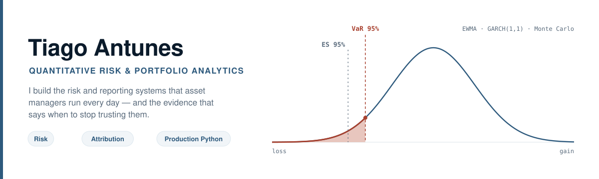
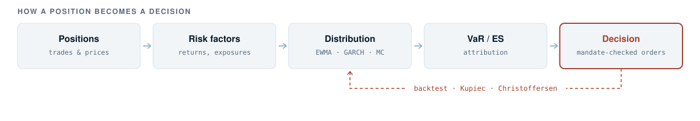

  <picture>
    <source media="(prefers-color-scheme: dark)" srcset="assets/hero-dark.svg">
    <source media="(prefers-color-scheme: light)" srcset="assets/hero-light.svg">
    
  </picture>

  
  
  

I work on risk and reporting systems for asset management: VaR and expected shortfall, performance
attribution, and the pipelines that produce them on a schedule. MSc in Data Science at NOVA IMS,
BSc in Applied Mathematics and Computation at Instituto Superior Técnico.

---

## Experience

### Técnico Investment Club &nbsp;   

Project Manager, Risk Team & Horizon Fund · Sep 2024 – Present · [live platform](https://tic-am.streamlit.app/)

A risk platform for **3 live funds**, used daily by **13 fund managers**. A 30-module Python engine
behind a Streamlit interface, with nightly CI, atomic database swaps, fail-closed data-quality gates
and **670+ automated tests**.

Risk measures are EWMA filtered historical simulation, GARCH(1,1) with volatility-regime detection,
Student-t, and 5-variant Monte Carlo, backtested with Kupiec and Christoffersen. Attribution is
Brinson-Fachler with Carino chain-linking. A Black-Litterman rebalancer produces mandate-capped,
pre-trade-compliant order lists with transaction costs. Fund commentary is written by an LLM, but
every figure in it is injected from code and checked against the source before the report renders.

I also maintain the club's Next.js site, with Vitest on units and Playwright on routing and mobile
layout. Both repositories are private.

### AlTi Global &nbsp;   

Quantitative Data Engineer, bachelor's thesis · Feb – Jul 2025 · NASDAQ-listed wealth manager, ≈$75B+ AUM/AUA · [sanitized code](https://github.com/tiagoslantunes/fund-reporting-etl)

Sole engineer on the fund reporting infrastructure. A vectorised NumPy/pandas pipeline computing 21
KPIs across 8 time windows under no-look-ahead constraints took the reporting cycle from hours to
**under 30 seconds across 200+ funds**.

Six Morningstar feeds were consolidated into one point-in-time source of truth with dynamic
multi-benchmark mapping, behind Power BI reporting used daily by the investment team and presented
to the CIO. Because the output went to regulated review, I also built a Pearson-ρ fund identity
detector (ρ ≥ 0.90, p < 10⁻⁹, validated over 20,000 Monte Carlo trials) and regex classification of
175 exposure headers, with **0% unknowns**.

### BPI Asset Management &nbsp;  

Risk Management Intern · Jul – Aug 2024 · CaixaBank Group · [alerts](https://github.com/tiagoslantunes/r-outlook-alerts-template) · [analytics](https://github.com/tiagoslantunes/fund-analytics-pipelines)

Daily liquidity monitoring across the fund range. I classified monthly fund flows into 5 movement
segments across 19 analytical sheets, producing **20+ client lifecycle KPIs** delivered to the CEO
of BPI Asset Management.

The manual morning check was replaced by an R and Outlook COM pipeline sending threshold-triggered
liquidity alerts before market open, with **zero missed reports** over the internship. Two further
pipelines covered cross-fund 2σ outlier detection and ARIMA(1,1,1) forecasting with 95% intervals.

---

## From positions to orders

  <picture>
    <source media="(prefers-color-scheme: dark)" srcset="assets/pipeline-dark.svg">
    <source media="(prefers-color-scheme: light)" srcset="assets/pipeline-light.svg">
    
  </picture>

The two headline numbers, whatever the asset class:

$$\mathrm{VaR}_{\alpha}(L) = \inf \lbrace \ell \in \mathbb{R} : \mathbb{P}(L \gt \ell) \le 1 - \alpha \rbrace$$

$$\mathrm{ES}_{\alpha}(L) = \frac{1}{1 - \alpha} \int_{\alpha}^{1} \mathrm{VaR}_{u}(L) \mathrm{d}u$$

Both depend entirely on the estimated distribution of $L$, which is where filtered historical
simulation, a GARCH recursion, a Student-t tail or a Monte Carlo engine come in. Backtesting decides
whether that estimate stays in production, which is what the dashed arrow does.

---

## Selected work

| Project | What it demonstrates | Stack |
|---|---|---|
| [Home Credit MLOps](https://github.com/tiagoslantunes/home-credit-mlops) | I owned splitting, model selection, MLflow, Optuna and SHAP | Python · Kedro · MLflow |
| [Used-car prices](https://github.com/tiagoslantunes/car-price-prediction) | Leakage-safe preprocessing and out-of-fold blending | Python · scikit-learn |

| Project | What it demonstrates | Stack |
|---|---|---|
| [Financial tweet sentiment](https://github.com/tiagoslantunes/text-mining-financial-sentiment) | FinBERT, ensembling, distillation, 10-fold out-of-fold | Python · PyTorch |
| [WikiArt painters](https://github.com/tiagoslantunes/wikiart-painter-classification) | Transfer learning over 23 painters, duplicate auditing | TensorFlow · Keras |
| [RL for ICU sepsis](https://github.com/tiagoslantunes/rl-icu-sepsis) | Tabular and deep RL with honest baselines | Stable-Baselines3 |

| Project | What it demonstrates | Stack |
|---|---|---|
| [Fund reporting ETL](https://github.com/tiagoslantunes/fund-reporting-etl) | The AlTi pattern: consolidation, no look-ahead, QA gates | pandas · Power BI |
| [GA image reconstruction](https://github.com/tiagoslantunes/cifo-ga-image-reconstruction) | 100 triangles, systematic tuning, CIEDE2000 | Genetic algorithms |
| [NovaTrade database](https://github.com/tiagoslantunes/novatrade-database) | Multi-currency brokerage schema and analytical views | MySQL · Python |

<b>More repositories</b>

 

| Project | Note |
|---|---|
| [Fund analytics pipelines](https://github.com/tiagoslantunes/fund-analytics-pipelines) | Report consolidation and client life-cycle analytics, from the BPI work |
| [Outlook alerts template](https://github.com/tiagoslantunes/r-outlook-alerts-template) | Sanitized HTML monitoring emails, configured by environment |
| [Yahtzee](https://github.com/tiagoslantunes/yahtzee-terminal-game) | Modular terminal application with scoring-rule tests |

Each repository documents its requirements, its outputs, and the limits of its conclusions. Group
coursework credits the full team.

---

## Toolkit

  
  &nbsp;&nbsp;
  
  &nbsp;&nbsp;
  
  &nbsp;&nbsp;
  
  &nbsp;&nbsp;
  
  &nbsp;&nbsp;
  
  &nbsp;&nbsp;
  
  &nbsp;&nbsp;
  
  &nbsp;&nbsp;
  
  &nbsp;&nbsp;
  
  &nbsp;&nbsp;
  
  &nbsp;&nbsp;
  
  &nbsp;&nbsp;
  
  &nbsp;&nbsp;
  

| Domain | Methods |
|---|---|
| **Risk & portfolio** | VaR/CVaR (EWMA, GARCH, backtesting), Brinson-Fachler and Carino attribution, MCTR/CCTR, stress testing, pre-trade compliance, Ledoit-Wolf shrinkage, Vasicek modelling |
| **Modelling** | Monte Carlo, efficient frontier, Black-Litterman, factor decomposition, ARIMA, ensembles, transfer learning, transformer fine-tuning and distillation, reinforcement learning |
| **Data & delivery** | ETL design, point-in-time data, SQL analytics, Power BI (DAX), CI gates, Docker, validated LLM chains |

---

## Background

-  &nbsp; **MSc, Data Science and Advanced Analytics** · [NOVA IMS](https://www.novaims.unl.pt/)
-  &nbsp; **BSc, Applied Mathematics and Computation** · [Instituto Superior Técnico](https://tecnico.ulisboa.pt/)
-  &nbsp; **Risk, analytics and web platforms** · [Técnico Investment Club](https://investmentclub.tecnico.ulisboa.pt/)

Portuguese (native) · English (C1) · Spanish (conversational).

---

  
  &nbsp;
  
  &nbsp;
  
  &nbsp;
  

